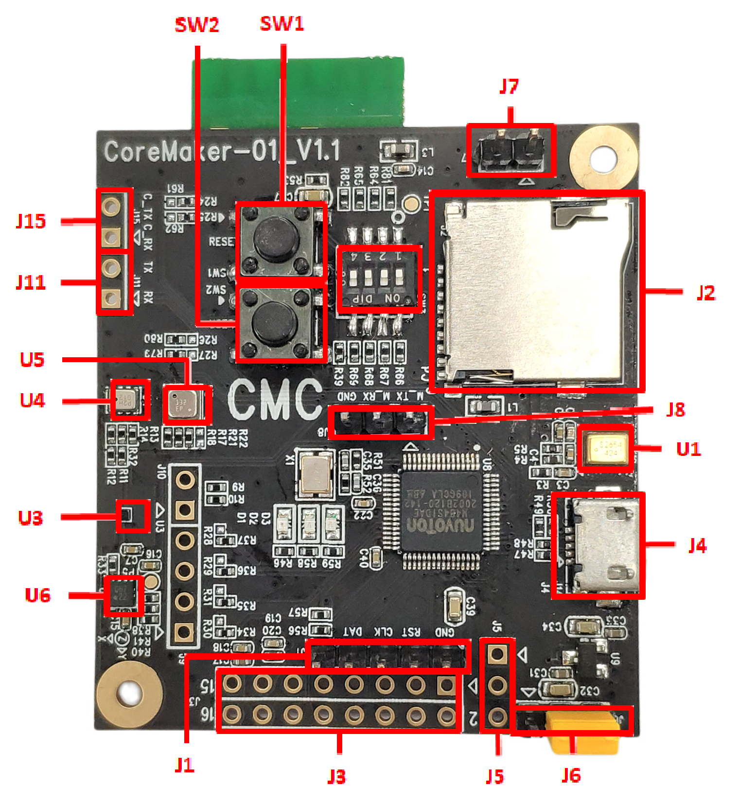

Menu
====

- [Board overview](#board-overview)
  - [Sensor](#sensor)
  - [LED](#led)
  - [Switch](#switch)
  - [Connector](#connector)
- [Requirements](#requirements)
- [Git clone](#git-clone)
- [Build project](#build-project)
    - [Configure and build in a single step](#configure-and-build-in-a-single-step)
    - [Build the project with CMake (advanced)](#build-the-project-with-cmake-advanced)
    - [Flash programming](#flash-programming)
- [Recommend editor](#recommend-editor)
  - [VSCode](#vscode)
    - [Extensions](#extensions)
    - [VSCode configuration](#vscode-configuration)
      - [CMake for mbed setting](#cmake-for-mbed-setting)
      - [C/C++ intellisense](#cc-intellisense)
      - [VSCode Tasks (Optional)](#vscode-tasks-optional)
- [Function Test](#function-test)
  - [Wifi](#wifi)
  - [SD card](#sd-card)
---

Board overview
==============



## Sensor

| Sensor | define         | description   |
| ------ | -------------- | ------------- |
| U1     | SPU0410LR5H-QB | Microphone    |
| U3     | GMC306A        | Geomagnetic   |
| U4     | GMP102         | Pressure      |
| U5     | BME680         | Environment   |
| U6     | KX122-103      | Accelerometer |

## LED

| LED | pin | define     |
| --- | --- | ---------- |
| D5  | PC7 | Red LED    |
| D6  | PC6 | Green LED  |
| D7  | PA5 | Yellow LED |

## Switch

| Switch | pin  | define           |
| ------ | ---- | ---------------- |
| SW1    | x    | Reset button     |
| SW2    | PA4  | PA4, user define |
| SW3_1  | X    |                  |
| SW3_2  | PF4  |                  |
| SW3_3  | PF5  |                  |
| SW3_4  | PA11 |                  |

## Connector

* J1

| pin | define  |
| --- | ------- |
| 1   | V33     |
| 2   | ICE_DAT |
| 3   | ICE_CLK |
| 4   | RESET   |
| 5   | GND     |

* J2: SD-Card

* J3

| pin | define          | pin | define          |
| --- | --------------- | --- | --------------- |
| 1   | EADC0_CH7_mikro | 2   | EPWM1_CH3_mikro |
| 3   | PC14_mikro      | 4   | PB13_mikro      |
| 5   | SPI3_SS_mikro   | 6   | UART2_RXD_mikro |
| 7   | SPI3_CLK_mikro  | 8   | UART2_TXD_mikro |
| 9   | SPI3_MISO_mikro | 10  | I2C0_SCL_mikro  |
| 11  | SPI3_MOSI_mikro | 12  | I2C0_SDA_mikro  |
| 13  | 3.3V            | 14  | 5V              |
| 15  | GND             | 16  | GND            |

* J4: USB

* J5

| pin | define       |
| --- | ------------ |
| 1   | Battery      |
| 2   | Boost_EN     |
| 3   | GND          |

* J6

| pin | define       |
| --- | ------------ |
| 1   | V5V_Battery  |
| 2   | V5V          |
| 3   | V5V_USB      |

* J7

| pin | define       |
| --- | ------------ |
| 1   | GND          |
| 2   | GND          |

* J8

| pin | define       |
| --- | ------------ |
| 1   | UART1_TXD    |
| 2   | UART1_RXD    |
| 3   | GND          |

* J11

| pin | define       |
| --- | ------------ |
| 1   | UART1_RX_ITM |
| 2   | UART1_TX_ITM |

* J15

| pin | define       |
| --- | ------------ |
| 1   | CMD_UART_TX  |
| 2   | CMD_UART_RX  |


Requirements
============

* Python 3.6 or newer.
* Pip
* CMake. Install version 3.19.0 or newer.
   * Windows: https://cmake.org/download/
   * Linux: `sudo apt install cmake`
* Ninja. Install version 1.0 or newer.
   ```
   python -m pip  install ninja
   ```
* Mbed CLI 2
   ```
   python -m pip install mbed-tools
   ```
   For more informations, please refer to https://os.mbed.com/docs/mbed-os/v6.15/build-tools/mbed-cli-2.html

* GNU Arm Embedded Toolchain
   * https://developer.arm.com/tools-and-software/open-source-software/developer-tools/gnu-toolchain/gnu-rm/downloads

* [環境架設步驟](https://github.com/CoretronicMEMS/CoreMaker-01/blob/master/docs/coremaker%E6%93%8D%E4%BD%9C%E6%8C%87%E5%8D%97_V1.1.pdf)
   * 引導您將上述架設環境內容完成


---

Git clone
=========

```
git clone --recurse-submodules <repo url>
```
And then program with your favorite editor, like Notepad++, Sublime, VS Code, etc.

* [下載步驟](https://github.com/CoretronicMEMS/CoreMaker-01/blob/master/docs/coremaker%E6%93%8D%E4%BD%9C%E6%8C%87%E5%8D%97_V1.1.pdf)
   *引導您將上述下載步驟玩成
---

Build project
=============

* Configure and build in a single step

   ```
   mbed-tools compile -m AIOT2101 -t GCC_ARM
   ```

### Build the project with CMake (advanced)

```
mbed-tools configure -t GCC_ARM -m AIOT2101
cmake -S . -B cmake_build/AIOT2101/develop/GCC_ARM -GNinja
cmake --build ./cmake_build/AIOT2101/develop/GCC_ARM
```
For more informations, please refer to https://os.mbed.com/docs/mbed-os/v6.15/build-tools/use.html


Recommend editor
================

## VSCode
   https://code.visualstudio.com/
   ### Extensions
   * C/C++
   * CMake

   ### VSCode configuration

   #### CMake for mbed setting
   
   Add `.vscode/settings.json`
   ```json
   "cmake.generator": "Ninja",
   "cmake.buildDirectory": "${workspaceFolder}/cmake_build/AIOT2101/develop/GCC_ARM",
   ```

   #### C/C++ intellisense

   Add `.vscode/c_cpp_properties.json`
   According to your environment to replace "compilerPath" setting.
   ``` json
   {
    "configurations": [
        {
            "name": "CortexM",
            "includePath": [
                "${workspaceFolder}/**"
            ],
            "defines": [],
            "cStandard": "gnu17",
            "compilerPath": "D:\\projects\\gcc-arm-none-eabi-9-2020-q2-update-win32\\bin\\arm-none-eabi-gcc.exe",
            "cppStandard": "gnu++14",
            "intelliSenseMode": "linux-gcc-arm",
            "compileCommands": "cmake_build/AIOT2101/develop/GCC_ARM/compile_commands.json",
            "configurationProvider": "ms-vscode.cmake-tools"
        }
    ],
    "version": 4
   }
   ```

   #### VSCode Tasks (Optional)

   Add `.vscode/tasks.json`
   ```json
   "tasks": [
      {
         "type": "shell",
         "label": "CMake Build",
         "command": "cmake.exe",
         "args": [
               "--build",
               "cmake_build/AIOT2101/develop/GCC_ARM/"
         ],
         "problemMatcher": [
               "$gcc"
         ],
         "group": {
               "kind": "build",
               "isDefault": true
         },
         "detail": "編譯器: cmake"
      }
   ]
   ```

---

Function Test
================

## Wifi
  1. Open the netassist application and start the tcp server
  2. Modify the main.cpp string to wifi_example.cpp string in CMakeLists.txt
  2. Modify the settings of wifi-ssid and wifi-password in mbed_app.json according to the router settings
  3. Convert the IP address and port on line 60 in wifi_example.cpp into the IP address and port of the tcp server
  4. Re-build image and burn image to pcb board
  5. After waiting for a period of time, confirm whether the tcp server has received the data, if so, the function is normal

## SD card
  1. Prepare a sdcard with fat32 format and plug into pcb board
  2. Modify the main.cpp string to sdcard_example.cpp string in CMakeLists.txt
  2. Re-build image and burn image to pcb board
  3. Check whether there is a file numbers.txt in the sdcard, and the content is a number from 0 to 9. If so, the sdcard function is normal