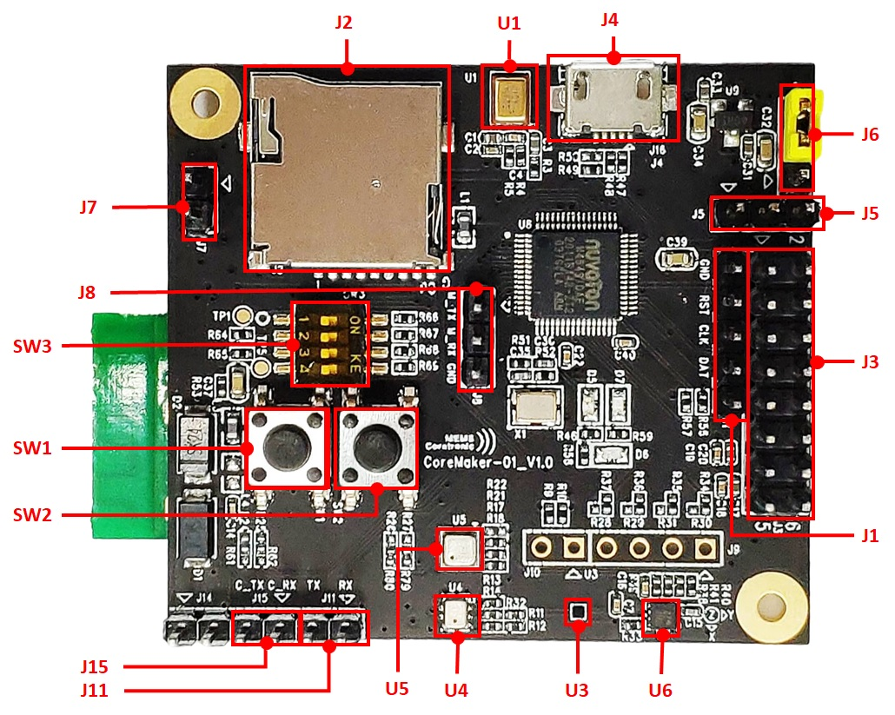

Menu
====

- [Menu](#menu)
- [Board overview](#board-overview)
  - [Sensor](#sensor)
  - [LED](#led)
  - [Switch](#switch)
  - [Connector](#connector)
- [Requirements](#requirements)
- [Git clone](#git-clone)
- [Build project](#build-project)
    - [Configure and build in a single step](#configure-and-build-in-a-single-step)
    - [Build the project with CMake (advanced)](#build-the-project-with-cmake-advanced)
    - [Flash programming](#flash-programming)
- [Recommend editor](#recommend-editor)
  - [VSCode](#vscode)
    - [Extensions](#extensions)
    - [VSCode configuration](#vscode-configuration)
      - [CMake for mbed setting](#cmake-for-mbed-setting)
      - [C/C++ intellisense](#cc-intellisense)
      - [VSCode Tasks (Optional)](#vscode-tasks-optional)

---

Board overview
==============



## Sensor

| Sensor | define         | description   |
| ------ | -------------- | ------------- |
| U1     | SPU0410LR5H-QB | Microphone    |
| U3     | GMC306A        | Geomagnetic   |
| U4     | GMP102         | Pressure      |
| U5     | BME680         | Environment   |
| U6     | KX122-103      | Accelerometer |

## LED

| LED | pin | define     |
| --- | --- | ---------- |
| D5  | PC7 | Red LED    |
| D6  | PC6 | Green LED  |
| D7  | PA5 | Yellow LED |

## Switch

| Switch | pin | define           |
| ------ | --- | ---------------- |
| SW1    | x   | Reset button     |
| SW2    | PA4 | PA4, user define |
| SW3_1  | X   |                  |
| SW3_2  | PF4 |                  |
| SW3_3  | PF5 |                  |
| SW3_4  | X   |                  |

## Connector

* J1

| pin | define  |
| --- | ------- |
| 1   | V33     |
| 2   | ICE_DAT |
| 3   | ICE_CLK |
| 4   | RESET   |
| 5   | GND     |

* J2: SD-Card

* J3

| pin | define          | pin | define          |
| --- | --------------- | --- | --------------- |
| 1   | EADC0_CH7_mikro | 2   | EPWM1_CH3_mikro |
| 3   | PC14_mikro      | 4   | PB13_mikro      |
| 5   | SPI3_SS_mikro   | 6   | UART2_RXD_mikro |
| 7   | SPI3_CLK_mikro  | 8   | UART2_TXD_mikro |
| 9   | SPI3_MISO_mikro | 10  | I2C0_SCL_mikro  |
| 11  | SPI3_MOSI_mikro | 12  | I2C0_SDA_mikro  |

* J4: USB

* J5

| pin | define       |
| --- | ------------ |
| 1   | Battery      |
| 2   | Boost_EN     |
| 3   | GND          |

* J6

| pin | define       |
| --- | ------------ |
| 1   | V5V_Battery  |
| 2   | V5V          |
| 3   | V5V_USB      |

* J7

| pin | define       |
| --- | ------------ |
| 1   | GND          |
| 2   | GND          |

* J8

| pin | define       |
| --- | ------------ |
| 1   | UART1_TXD    |
| 2   | UART1_RXD    |
| 3   | GND          |

* J11

| pin | define       |
| --- | ------------ |
| 1   | UART1_RX_ITM |
| 2   | UART1_TX_ITM |

* J15

| pin | define       |
| --- | ------------ |
| 1   | CMD_UART_TX  |
| 2   | CMD_UART_RX  |


Requirements
============

* Python 3.6 or newer.
* Pip
* CMake. Install version 3.19.0 or newer.
   * Windows: https://cmake.org/download/
   * Linux: `sudo apt install cmake`
* Ninja. Install version 1.0 or newer.
   ```
   python -m pip  install ninja
   ```
* Mbed CLI 2
   ```
   python -m pip install mbed-tools
   ```

* GNU Arm Embedded Toolchain
   * https://developer.arm.com/tools-and-software/open-source-software/developer-tools/gnu-toolchain/gnu-rm/downloads

* NuMicro_ICP_Programming_Tool
   * https://www.nuvoton.com/support/tool-and-software/software/programmer/?__locale=zh_TW

---

Git clone
=========

```
git clone --recurse-submodules <repo url>
```

---

Build project
=============

### Configure and build in a single step

```
mbed-tools compile -m AIOT2101 -t GCC_ARM
```

### Build the project with CMake (advanced)

```
mbed-tools configure -t GCC_ARM -m AIOT2101
cmake -S . -B cmake_build/AIOT2101/develop/GCC_ARM -GNinja
cmake --build ./cmake_build/AIOT2101/develop/GCC_ARM
```

### Flash programming

  1. Open NuMicro_ICP_Programming_Tool
  2. Select `M480 series`
  3. Select `APROM` file (*.bin or *.hex)
     ```./cmake_build/AIOT2101/develop/GCC_ARM/AIOT_2101.bin```
  4. Enable `APROM` check box
  5. Press `Start`

---

Recommend editor
================

## VSCode
   https://code.visualstudio.com/
   ### Extensions
   * C/C++
   * CMake

   ### VSCode configuration

   #### CMake for mbed setting
   
   Add `.vscode/settings.json`
   ```json
   "cmake.generator": "Ninja",
   "cmake.buildDirectory": "${workspaceFolder}/cmake_build/AIOT2101/develop/GCC_ARM",
   ```

   #### C/C++ intellisense

   Add `.vscode/c_cpp_properties.json`
   According to your environment to replace "compilerPath" setting.
   ``` json
   {
    "configurations": [
        {
            "name": "CortexM",
            "includePath": [
                "${workspaceFolder}/**"
            ],
            "defines": [],
            "cStandard": "gnu17",
            "compilerPath": "D:\\projects\\gcc-arm-none-eabi-9-2020-q2-update-win32\\bin\\arm-none-eabi-gcc.exe",
            "cppStandard": "gnu++14",
            "intelliSenseMode": "linux-gcc-arm",
            "compileCommands": "cmake_build/AIOT2101/develop/GCC_ARM/compile_commands.json",
            "configurationProvider": "ms-vscode.cmake-tools"
        }
    ],
    "version": 4
}
```

   #### VSCode Tasks (Optional)

   Add `.vscode/tasks.json`
   ```json
   "tasks": [
      {
         "type": "shell",
         "label": "CMake Build",
         "command": "cmake.exe",
         "args": [
               "--build",
               "cmake_build/AIOT2101/develop/GCC_ARM/"
         ],
         "problemMatcher": [
               "$gcc"
         ],
         "group": {
               "kind": "build",
               "isDefault": true
         },
         "detail": "編譯器: cmake"
      }
   ]
   ```